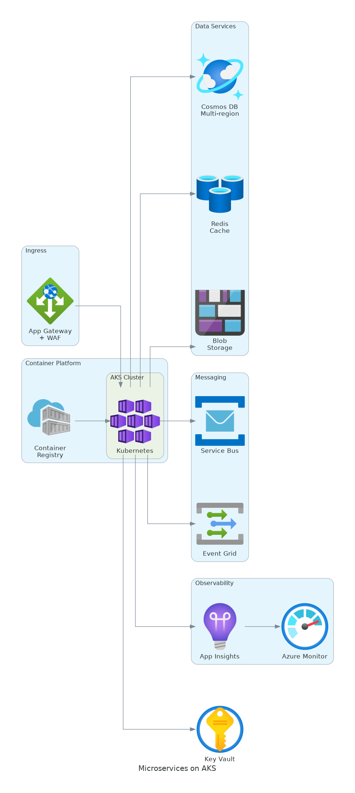
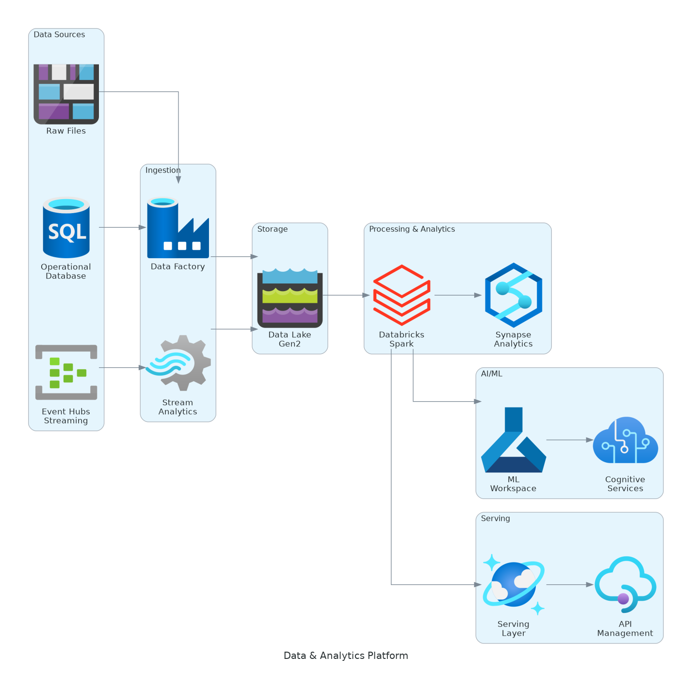
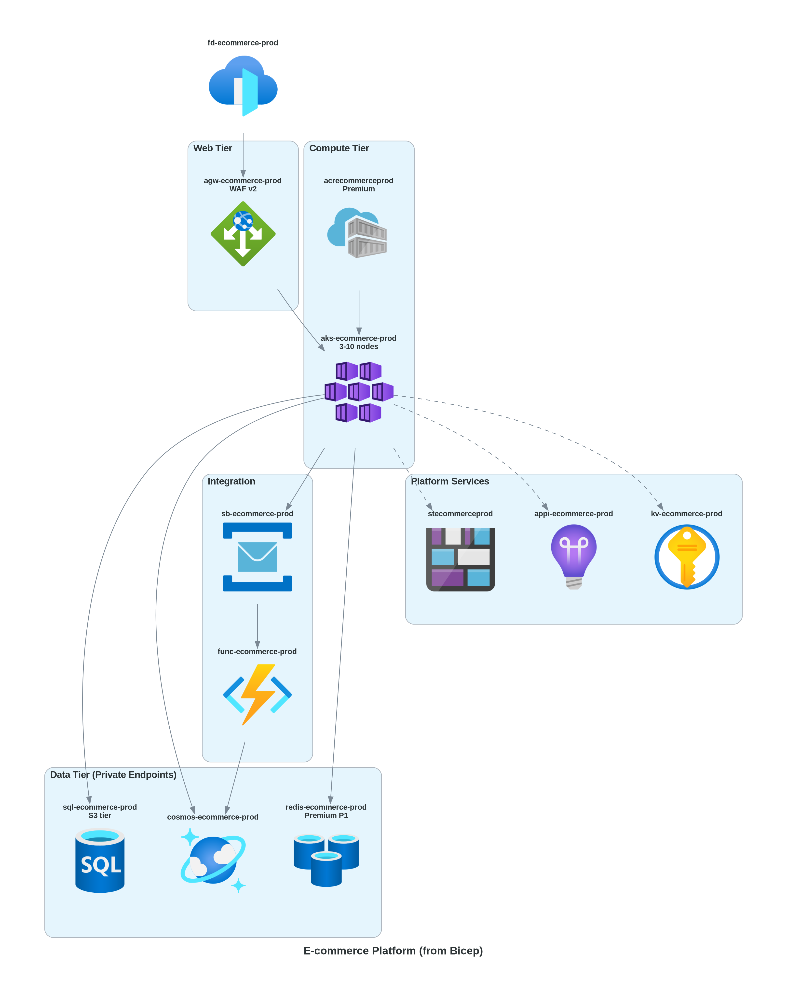
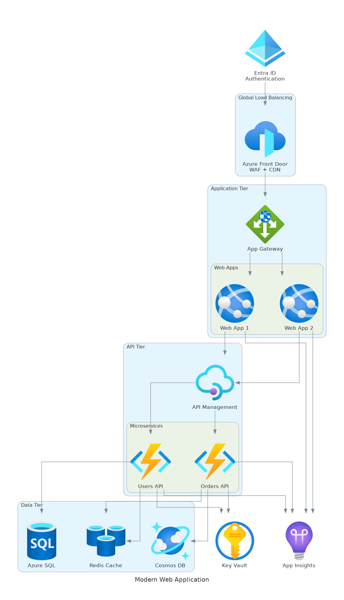
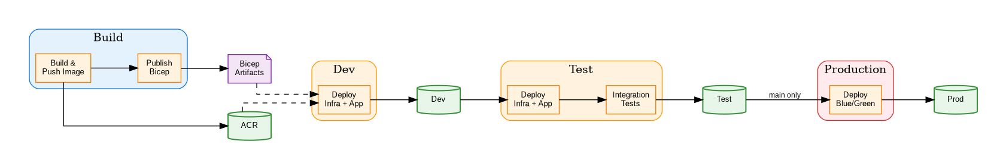
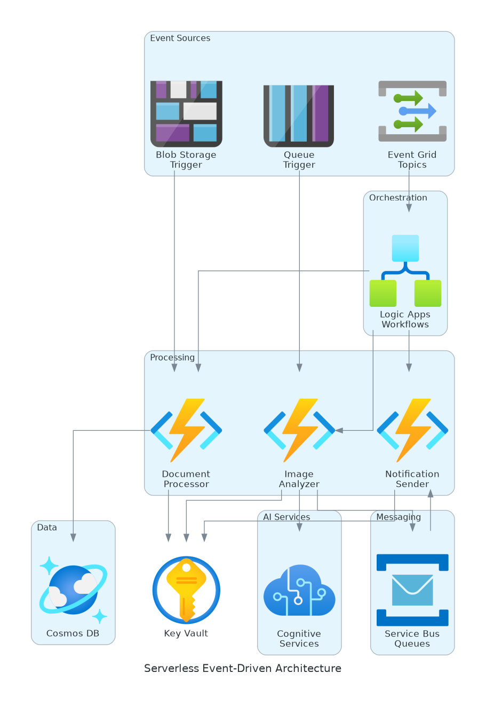
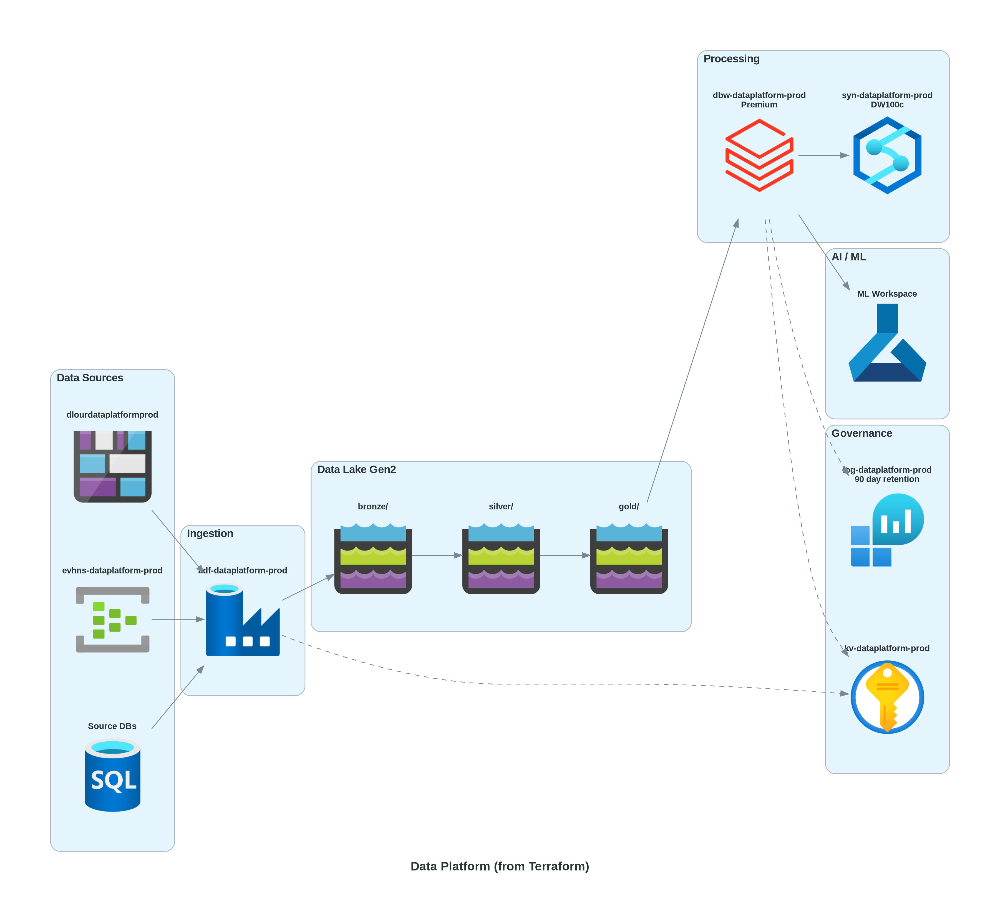

# Azure Diagrams Skill

A comprehensive technical diagramming toolkit for **solutions architects**, **presales engineers**, and **developers**. Generate professional diagrams for proposals, documentation, and architecture reviews.

<p align="center">
  
  <br>
  <em>Professional architecture diagram generated in seconds</em>
</p>

##  What You Can Create

| Diagram Type | Use Case | Example Prompt |
|--------------|----------|----------------|
| ** Azure Architecture** | Solution designs, infrastructure docs | "Design a microservices architecture with AKS, Cosmos DB, and Service Bus" |
| ** Business Process Flows** | Workflows, approvals, swimlanes | "Create a swimlane diagram for the invoice approval process" |
| ** Entity Relationship (ERD)** | Database schemas, data models | "Generate an ERD for customer, order, and product entities" |
| ** Timeline / Gantt** | Project roadmaps, migration plans | "Create a 6-month cloud migration timeline with 4 phases" |
| ** UI Wireframes** | Dashboard mockups, screen layouts | "Design a KPI dashboard with charts, metrics, and data table" |
| ** Sequence Diagrams** | Auth flows, API interactions | "Show the OAuth 2.0 authorization code flow" |
| ** Network Topology** | Hub-spoke, VNets, hybrid cloud | "Create a hub-spoke network with shared services and 3 workloads" |

##  Built For

- **Presales Engineers** - Create architecture diagrams for proposals in minutes
- **Solutions Architects** - Document designs with professional quality
- **Developers** - Generate ERDs, flowcharts, and technical documentation
- **Project Managers** - Build timelines and roadmaps
- **Business Analysts** - Create process flows and swimlane diagrams

##  700+ Azure Components

Official Microsoft icons for all Azure services:

| Category | Services |
|----------|----------|
| **Compute** | VMs, AKS, Functions, App Service, Container Apps, Batch |
| **Networking** | VNets, Load Balancer, App Gateway, Front Door, Firewall, ExpressRoute |
| **Database** | SQL, Cosmos DB, PostgreSQL, MySQL, Redis, Synapse |
| **Storage** | Blob, Data Lake, Files, NetApp, Queue |
| **Integration** | Logic Apps, Service Bus, Event Grid, APIM, Data Factory |
| **Security** | Key Vault, Sentinel, Defender, Entra ID, Managed Identity |
| **AI/ML** | Azure OpenAI, Cognitive Services, ML Workspace, Bot Service |
| **Analytics** | Synapse, Databricks, Data Explorer, Stream Analytics, Event Hubs |
| **DevOps** | Azure DevOps, Pipelines, Repos, Boards, Artifacts |
| **IoT** | IoT Hub, IoT Edge, Digital Twins, Time Series Insights |

##  Quick Start

##  Installation

### Prerequisites
```bash
pip install diagrams matplotlib
apt-get install graphviz  # or: brew install graphviz (macOS)
```

### For GitHub Copilot

Copy the skill folder to your repository:
```bash
cp -r .github/skills/azure-diagrams YOUR_REPO/.github/skills/
```

### For Claude Code CLI

Install directly from GitHub:
```bash
claude install github:YOUR_USERNAME/azure-diagrams-skill
```

Or install from a local folder:
```bash
claude install ./path/to/azure-diagrams
```

### For Claude.ai

Upload the skill folder to a Claude Project, or simply share the GitHub link and ask Claude to reference it.

### Verify Installation
```bash
# Check prerequisites are installed
python -c "import diagrams; print('✓ diagrams installed')"
dot -V  # Should show graphviz version
```

### Example Prompts

**Architecture Diagram:**
```
Create an e-commerce platform architecture with:
- Front Door for global load balancing
- AKS for microservices
- Cosmos DB for product catalog
- Redis for session cache
- Service Bus for order processing
```

**Business Process Flow:**
```
Create a swimlane diagram for employee onboarding with lanes for:
- HR, IT, Manager, and New Employee
Show the process from offer acceptance to first day completion
```

**ERD Diagram:**
```
Generate an entity relationship diagram for an order management system with:
- Customers, Orders, OrderItems, Products, Categories
- Show primary keys, foreign keys, and cardinality
```

**Project Timeline:**
```
Create a cloud migration timeline showing:
- Phase 1: Assessment (Month 1-2)
- Phase 2: Pilot Migration (Month 3-4)
- Phase 3: Production Migration (Month 5-8)
- Phase 4: Optimization (Month 9-12)
```

**UI Wireframe:**
```
Design a sales dashboard wireframe with:
- Header with logo and navigation
- KPI cards showing revenue, deals, conversion rate
- Line chart for monthly trends
- Table of recent opportunities
```

<p align="center">
  
  <br>
  <em>Data platform with Databricks, Synapse, and Data Lake</em>
</p>

##  Bonus: Generate from Infrastructure Code

Can also create diagrams directly from your IaC:

```
Read the Bicep files in /infra and generate an architecture diagram 
showing all resources grouped by subnet
```

```
Analyze our Terraform modules and create a data flow diagram
```

```
Parse azure-pipelines.yml and create a CI/CD deployment diagram
```

Supports: **Bicep** • **Terraform** • **ARM Templates** • **Azure Pipelines** • **GitHub Actions**

<p align="center">
  
  <br>
  <em>Architecture generated from Bicep with actual resource names</em>
</p>

##  What's Included

```
azure-diagrams/
├── SKILL.md                              # Main skill instructions
├── references/
│   ├── azure-components.md               # 700+ Azure components
│   ├── common-patterns.md                # Architecture patterns
│   ├── business-process-flows.md         # Workflow & swimlane patterns
│   ├── entity-relationship-diagrams.md   # ERD patterns
│   ├── timeline-gantt-diagrams.md        # Timeline patterns
│   ├── ui-wireframe-diagrams.md          # Wireframe patterns
│   ├── iac-to-diagram.md                 # Generate from Bicep/Terraform
│   ├── preventing-overlaps.md            # Layout troubleshooting
│   └── quick-reference.md                # Copy-paste snippets
└── scripts/
    ├── generate_diagram.py               # Interactive generator
    └── verify_installation.py            # Check prerequisites
```

##  Compatibility

| Tool | Status |
|------|--------|
| GitHub Copilot | ✅ |
| Claude | ✅ |
| VS Code Copilot | ✅ |

Built on the [Agent Skills](https://agentskills.io) open standard.

##  Example Gallery

| Architecture | Business Flow | Data Platform |
|--------------|---------------|---------------|
|  |  |  |
| 3-Tier Web App | CI/CD Pipeline | Analytics Platform |

| Microservices | Serverless | From Terraform |
|---------------|------------|----------------|
|  |  |  |
| AKS + Services | Event-Driven | IaC Generated |

##  Contributing

Contributions welcome! Ideas:
- Additional architecture patterns
- New diagram types
- More Azure service coverage
- Bug fixes and improvements

See [CONTRIBUTING.md](CONTRIBUTING.md) for guidelines.

##  License

MIT License - free to use, modify, and distribute.

##  Credits

- [diagrams](https://diagrams.mingrammer.com/) - Diagram as Code library
- [Graphviz](https://graphviz.org/) - Graph visualization
- [Agent Skills](https://agentskills.io) - Open standard for AI skills
